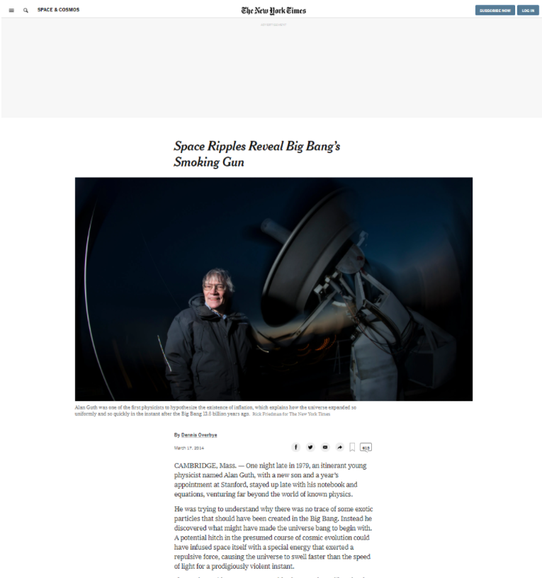

## Week 1

# Project 1 : Positioning and Floating Elements

> This Project consists of making a clone of a New York Times article page.

You can find the original project specification at: https://www.theodinproject.com/courses/html5-and-css3/lessons/positioning-and-floating-elements

## Built With

- HTML
- CSS
- VScode & Atom as code editors
- Chrome Dev tools

## Live Demo 

[Live Demo Link]( https://elisha2kyakpo1.github.io/New-york-times-Milestone/) 

## Authors

👤 **Elisha Kyakopo**

- GitHub: [@elisha2kyakpo1](https://github.com/elisha2kyakpo1)
- LinkedIn: [LinkedIn](https://www.linkedin.com/in/elisha-kyakopo-009aa3197/)

👤 **Omar Rashad**

- GitHub: [@od-c0d3r](https://github.com/od-c0d3r)
- Twitter: [@od_coder](https://twitter.com/od_coder)
- LinkedIn: [LinkedIn](https://www.linkedin.com/in/omarrashad/)

## 🤝 Contributing

Contributions, issues, and feature requests are welcome!

## Show your support

Give a ⭐️ if you like this project!
